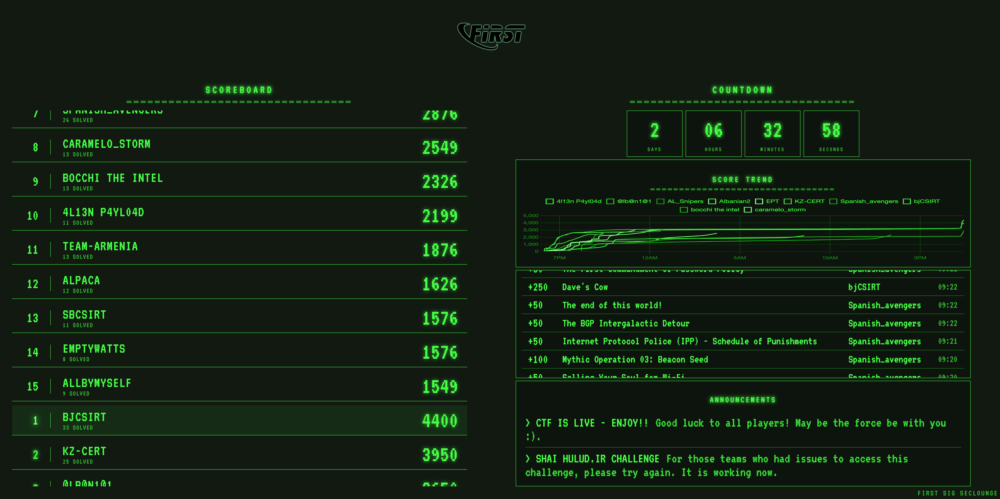

# FIRST CTF Scoreboard

Live scoreboard for FIRST CTF events, featuring real-time score updates, countdown timer, score trend graph, announcements feed, and latest submissions.



## Features

- Pre-CTF waiting page with large countdown and registration information
- Real-time scoreboard (top 15 teams) with auto-scroll and AJAX auto-refresh
- Countdown timer to CTF end
- Last-hour full-screen "FINAL COUNTDOWN" takeover (themed per active theme)
- Automatic CTFd scoreboard freeze when <1 hour remains (hides scores from participants)
- Score trend graph (top 10 teams over time) with periodic refresh
- Auto-rolling announcements from CTFd notifications (large font for big screens)
- Latest submissions feed (optimised font size for large displays)
- Gold/silver/bronze podium styling for top 3
- Multiple theme variants (neon hacker, 90s retro, 80s TRS-80, 80s CRT)
- Projector/beamer-optimised default 80s theme (high contrast, no flicker)
- 4K / big screen display support with responsive clamp-based font sizing

## Configuration

All parameters are configured via environment variables:

| Variable                | Description                              | Default                                     |
|-------------------------|------------------------------------------|---------------------------------------------|
| `CTFD_BASE_URL`         | CTFd API base URL                        | `https://ctf.firstseclounge.org/api/v1`     |
| `CTFD_API_KEY`          | CTFd API token (required for freeze)     | *(empty)*                                   |
| `CTF_START`             | CTF start date (waiting page countdown)  | `June 15 2026 10:00:00 GMT-0600`            |
| `CTF_DEADLINE`          | CTF end date (scoreboard countdown)      | `June 18 2026 16:00:00 GMT-0600`            |
| `CTF_TITLE`             | Title displayed on the scoreboard        | `FIRST CTF 2026`                            |
| `CTF_REGISTRATION_URL`  | Registration URL shown on waiting page   | `https://ctf.firstseclounge.org`            |
| `CTF_REGISTRATION_CODE` | Registration code shown on waiting page  | *(empty)*                                   |
| `CTF_THEME`             | Active theme: `default`, `90s`, or `80s` | `80s`                                       |

> **⚠️ Security note:** Never commit API keys. Pass `CTFD_API_KEY` via environment variable at runtime.

## Local setup

Requires Python 3 and virtualenv.

```bash
virtualenv -p python3 env
source env/bin/activate
pip install -r requirements.txt

export CTFD_BASE_URL=https://ctf.firstseclounge.org/api/v1
export CTFD_API_KEY=ctfd_xxxxxxxxxxxx
export CTF_START="June 15 2026 10:00:00 GMT-0600"
export CTF_DEADLINE="June 18 2026 16:00:00 GMT-0600"
export CTF_TITLE="FIRST CTF 2026"
export CTF_REGISTRATION_URL="https://ctf.firstseclounge.org"
export CTF_REGISTRATION_CODE="!chackers_2026!"
export CTF_THEME=80s

python app.py
```

Visit http://localhost:8080

## Docker setup

Build the container:

```bash
docker build -t scoreboard .
```

Run the container:

```bash
docker run -p 8888:80 -d \
  -e CTFD_BASE_URL=https://ctf.firstseclounge.org/api/v1 \
  -e CTFD_API_KEY=ctfd_xxxxxxxxxxxx \
  -e CTF_START="June 15 2026 10:00:00 GMT-0600" \
  -e CTF_DEADLINE="June 18 2026 16:00:00 GMT-0600" \
  -e CTF_TITLE="FIRST CTF 2026" \
  -e CTF_REGISTRATION_URL="https://ctf.firstseclounge.org" \
  -e CTF_REGISTRATION_CODE="!chackers_2026!" \
  -e CTF_THEME=80s \
  --name scoreboard \
  scoreboard
```

## Deployment (scoreboard.ctfsig.org)

The scoreboard runs as a Docker container on `first-ctf-01.ctfsig.org` (145.239.10.190). To redeploy:

```bash
rsync -avz --exclude='env/' --exclude='__pycache__/' --exclude='.git/' ./ ubuntu@first-ctf-01.ctfsig.org:/home/ubuntu/Scoreboard/

ssh ubuntu@first-ctf-01.ctfsig.org 'cd /home/ubuntu/Scoreboard &&
  sudo docker build -t scoreboard . &&
  sudo docker stop scoreboard &&
  sudo docker rm scoreboard &&
  sudo docker run -p 8888:80 -d --name scoreboard \
    -e CTFD_BASE_URL=https://ctf.firstseclounge.org/api/v1 \
    -e CTFD_API_KEY=ctfd_xxxxxxxxxxxx \
    -e "CTF_START=June 15 2026 10:00:00 GMT-0600" \
    -e "CTF_DEADLINE=June 18 2026 16:00:00 GMT-0600" \
    -e "CTF_TITLE=FIRST CTF 2026" \
    -e CTF_REGISTRATION_URL=https://ctf.firstseclounge.org \
    -e "CTF_REGISTRATION_CODE=!chackers_2026!" \
    -e CTF_THEME=80s \
    scoreboard'
```

> **Note:** The outer single quotes prevent zsh from interpreting `!` as history expansion.

## Routes

| Path             | Description                                                          |
|------------------|----------------------------------------------------------------------|
| `/`              | Smart redirect based on `CTF_THEME` and time (waiting → scoreboard) |
| `/waiting`       | Pre-CTF page: large countdown + registration info (neon hacker)      |
| `/waiting90`     | Pre-CTF page — 90s retro theme                                      |
| `/waiting80`     | Pre-CTF page — 80s TRS-80 theme                                     |
| `/scoreboard`    | Main display — neon hacker theme                                     |
| `/scoreboard90`  | 90s retro theme (multi-color, blink)                                 |
| `/scoreboard80`  | 80s TRS-80 theme — projector/beamer optimised (high contrast)        |
| `/scoreboard80crt` | 80s TRS-80 theme — original CRT (vignette, flicker, scanlines)    |
| `/data`          | Team rankings (loaded via AJAX)                                      |
| `/latest`        | Latest submissions (loaded via AJAX)                                 |
| `/trenddata`     | Score trend JSON for Chart.js                                        |
| `/notifications` | CTFd announcements (loaded via AJAX)                                 |
| `/timer`         | Standalone countdown page                                            |
| `/results`       | Final results page                                                   |

## Lifecycle

The scoreboard adapts automatically based on time:

1. **Before CTF start** — `/` redirects to the waiting page matching `CTF_THEME`
2. **During CTF** — `/` redirects to the scoreboard matching `CTF_THEME`
3. **Last hour** — Scoreboard page switches to a full-screen themed "FINAL COUNTDOWN" overlay; a background thread automatically freezes CTFd scores (`score_visibility → admins`)
4. **After CTF** — Use `/results` for final standings; manually unfreeze via CTFd admin or the `freeze_scoreboard.py` script in CTFd-scripts

## Themes

Four visual themes are available, each accessible via its own route:

| Theme | Route | Description |
|-------|-------|-------------|
| Neon Hacker | `/scoreboard` | Dark background, green neon accents, Orbitron + Fira Code fonts |
| 90s Retro | `/scoreboard90` | Black background, multi-color neon (green/cyan/yellow/red), Press Start 2P font, scanlines |
| 80s TRS-80 | `/scoreboard80` | **Default** — Projector-optimised high-contrast monochrome green, VT323 font, no flicker |
| 80s TRS-80 CRT | `/scoreboard80crt` | Original CRT look — vignette, flicker, heavy scanlines (best on monitors in dark rooms) |

Theme files:
- `static/css/style.css` — Neon Hacker
- `static/css/style-90s.css` — 90s Retro
- `static/css/style-80s.css` — 80s TRS-80 (projector-friendly)
- `static/css/style-80s-crt.css` — 80s TRS-80 CRT (original)

## Tech stack

- Python 3 / Flask / Gunicorn
- Chart.js (score trend graph)
- jQuery (AJAX data loading)
- Google Fonts: Orbitron, VT323, Fira Code, Press Start 2P, Share Tech Mono
